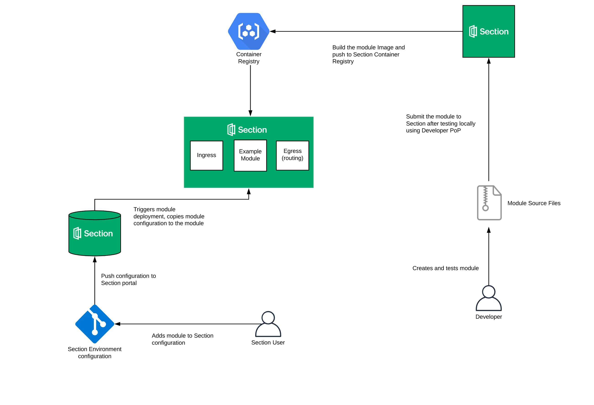

# Run custom workload at the edge

The repository gives a starting point on how to build modules to run on Section's Edge Compute network.

### What is Section?

Section’s Edge Compute Platform gives Dev and Ops engineers the access and control they need to run compute workloads on a distributed edge. Website : https://www.section.io/


### What is a module?

A module as defined by Section is a Docker image with custom workload running on Section's edge infrastructure orchestarted by Kubernetes.

Some modules running on Section : https://www.section.io/modules/


### How do customers start using your module?

We will further explain the process of building your own module but the overall architecutre diagram is a good place to start




1. Build and test your module using Section's [Developer PoP](https://www.section.io/docs/developer-workflow/tutorials/setting-up-your-developer-pop/) which allows you to experience how your module will behave at Section's edge location locally.
2. Submit the build files to Section.
3. Section will publish your module to Section's container registry.
4. Customers can add your module to their configuration and push it to Section.
5. This will trigger the Section infrastructure to pull the build module from the container registry and run it on our edge locations worldwide.


## Getting Started :

#### Directory Structure:

```
├── Dockerfile
├── create-module-assets.sh
└── example-module
    ├── Dockerfile
    ├── .section-proxy.yaml
    └── src
        ├── environment_variables.lua.gotemplate
        ├── handler
        │   └── app
        │       ├── Example GO Handler
        ├── lib
        │   └── section
        │       ├── Example LUA Modules
        ├── module_schema.json
        ├── proxy
        │   ├── content.lua
        │   ├── nginx.conf
        │   └── pubkey.gpg
        └── tests
            ├── invalid-module.json
            ├── resolv.conf
            └── valid-module.json
```


At the top level we have :

- **create-module-assets.sh** : Helper script to build the module image locally and have it ready to be deployed in Developer PoP
- **Dockerfile** : Used by the helper script to set up module validation in Developer PoP
- **example-module** : Contains assets used to build the module. Further explanation provided within the sub-directories.


#### Running this example

1. Make sure you have Developer PoP running on your local machine : https://www.section.io/docs/developer-workflow/tutorials/setting-up-your-developer-pop/
2. Run `bash create-module-assets.sh` to build the *example-module* image and set up Developer PoP to validate the module.
3. Add the newly created module to your Section environment configuration file : https://www.section.io/docs/platform/environment/how-tos/install-a-new-proxy/
4. Commit and push the updated configuration to the Developer-PoP.

The sub-directories within this example contain further explanation on what constitutes a module. We have also heavily commented out the example source files. If you think something is lacking or if you need further help with the process of running your custom workload at edge feel free to reach out at support@section.io and we will be more than happy to help you.
